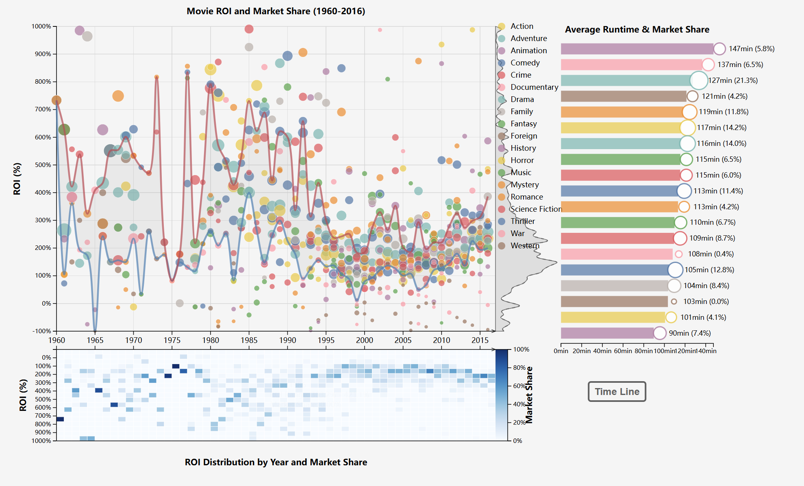

# 电影趋势可视化分析（1916 - 2016）

## 项目简介

本项目旨在对1916年至2016年间5000部电影的数据进行可视化展示和分析。通过利用互联网上的开源电影数据集，我们筛选并整理了约3000条有效数据，以便提供有意义的洞察。

## 小组成员

- 韩琦卓 2310428
- 丁益三 2310724
- 孔祥昊 2311439

## Quick Start

```bash
npm install
npm start
```
## 数据来源

- **数据集**：[TMDB_5000_Movies数据集](https://www.heywhale.com/mw/dataset/5daea88575df5c002b212240/content/)
- **内容**：包含TMDb上5000部电影的详细信息，包括上映日期、类型、预算、票房和评分等。
- **数据预处理**：筛选和清洗后保留了约3000条相关记录，用于有效的可视化展示。


## 图表介绍

### ChartⅠ. Genres, Ratings, and ROI: A Time-Lapse of Movie Trends

#### 交互式时间线

- **时间滑块**：可浏览1916年至2016年间的电影上映情况 (实际选取了1972-2016作为时间轴，因为早期数据密度较小)
- **动态显示**：调整滑块后，图表会实时更新，展示截至选定日期前上映的所有电影。
- **气泡遮挡**：随着时间进度条的行进，后面上映的电影气泡会遮挡在前面，遮挡关系越靠前，代表电影越新
- **多种过滤器**：实际上，时间维度、类型维度和横纵比例尺都是图表的过滤器，可以灵活地共同作用。

#### 气泡图表

- **维度展示**：
  - **X轴**：TMDb评分或预算（可切换）。
  - **Y轴**：票房收入（百万美元）。
  - **气泡大小**：表示电影的预算（在第一种视图中）
  - **气泡透明度**：表示电影的评分（在第二种视图中）
  - **颜色**：代表电影类型。
- **交互功能**：
  - **图例悬停**：展示单类别
  - **图例点击**：点击图例中的类型，可以过滤并高亮对应类型的电影。
  - **气泡点击**：锁定选定的电影，突出显示其类型，并提供豆瓣链接以获取更多信息。

#### 柱状图

- **自适应图例**：显示各类型电影的平均或最高预算、票房和评分。
- **下拉菜单**：选择不同的数据维度，如平均预算、票房或评分，来可视化随时间的变化趋势。

#### 额外控制元素

- **滑块**：
  - **Y轴最大值滑块**：调整票房收入轴的最大值。
  - **X轴最大值滑块**：调整预算轴的最大值（切换后可见）。
- **按钮**：
  - **自动切换**：自动更新可视化基于时间线。
  - **重播**：从最早日期重新开始动画。
  - **暂停/继续**：控制时间线动画的播放。
  - **切换轴**：在IMDb评分和预算之间切换X轴。
  - **导航**：跳转至详细的投资回报率（ROI）和市场份额分析页面。

#### 核密度估计（KDE）图

- **动态适应**：根据当前筛选条件和选择，反映票房收入的分布情况。
- **交互洞察**：帮助理解选定类型和时间范围内的数据分布趋势。

#### 结果（故事）

- 随着时间的推移，电影的预算和票房整体是在走高的。
- 并非高评分就能带来高票房，高票房也不一定带来高评分。两者大致呈现正态分布。
- 电影收益和电影预算有一个大致的线性正相关或类似指数正相关关系，但是不同类别的电影的相关度不尽相同。
- 几十年间，Animation动画电影的预算逐渐走高，排名快速上升，这体现了此类电影从手绘到计算机制作，制作成本和制作效果高速的发展的过程，到了后期，它占据了第一的位置，就可以知道现在这个时间，要想拍一部动画电影，成本是不太可能很低的。
- 1997的泰坦尼克号、2009的阿凡达，分别引领了各自类型的票房记录。从他们之后，电影的平均预算呈加速走高的趋势，引领了大制作的潮流。
- 恐怖电影在几十年间逐渐失宠，收益、评分的相对排名都逐渐走低。
- 动画电影、冒险电影的票房在各分段排布最为均匀；其他类型电影的高票房电影远远少于中低票房电影。


### ChartⅡ. Visualize Movie Data about ROI and Shared Market

#### 项目子图概述

本项目旨在通过可视化的方式，呈现电影市场中不同影视类型、不同年代的投资、票房、市场份额等数据。并且以此为分析在电影产业的发展概况

#### 功能描述

#### ROI 和 Market 的计算

$$
ROI =\dfrac{Revenue-Fund}{Fund}\times100\%
$$
$$
SharedMarket_i=\dfrac{genre_iRevenue_i}{\sum_{i}^n genre_iRevenue_i}
$$
使用python 进行计算，得到的结果保存在`market_share_data.json`和`roi_data.json`文件中。
#### 可视化图表
可视化的图表主要分为两类：`Bubble Map` 和`Heat Map`,这两者在设计上共X轴，即共用`XScale`
##### Bubble Map
###### 功能描述
- 气泡图：每个气泡代表一个特定年份和电影，气泡的大小根据市场份额的大小变化，颜色表示电影类别。
    - 用户可以通过鼠标悬停高亮显示特定电影类别的气泡，并显示该电影类别的市场份额、投资回报率、票房数据。
    - 用户可以通过点击特定电影类别的气泡，显示该电影的ROI数据分布、市场份额数据。
- 核密度估计（KDE）：通过对所有 ROI 数据的核密度估计，展示投资回报率的分布情况。
- 分布曲线：以线条和填充区域展示 ROI 数据的密度分布。
- 四分位数线：每年 ROI 的上下四分位数（Q1 和 Q3）用线条表示，反映了数据的集中趋势，即反应据大多数的市场份额的比例
- 图例：图例展示了不同颜色代表的电影类型
    - 用户可以通过鼠标悬停高亮显示特定影视的气泡。
    - 用户可以通过点击特定影视的气泡，显示该电影的1960-2016年的投资回报率和市场占有数据分布。
##### Heat Map
- 功能描述：热力图：每个格子代表一个特定年份和电影，格子的颜色表示市场份额，Y数值表示投资回报率。
- 交互功能
    - 与上面的图表的交互
        - 鼠标悬停在某点时可以显示在上面气泡图的对应投资回报率区间的各种类的电影
    - 与其本身的交互
        - 在右侧图例处显示对应的市场占有率的值
        - 在图例的右边显示对应年份各个种类的电影的以ROI排序的的核密度曲线
##### runTime Map
- 功能描述：每一行代表特定类别电影的时间，圈的大小代表市场占比
- 交互功能
    - 鼠标右键单击左侧的气泡图的，将runtime map 转变为对应年的各类电影的放映时间

##### Image
- 在右下角加入了一个Image，当鼠标悬浮在气泡图的点时，会产生一下三种情况。
    - 该点对应的小于下4分位的投资回报率，即资本家获得了低于市场平均水平的回报。
    - 该点对应的大于上4分位的投资回报率，即资本家获得超额利润
    - 该点对应的在4分位上下的数据，即资本家获得了平均利润。
- 会根据不同的情况，显示不同的图片。
- 点击可以可以关闭这个WEBP 图片。
  
##### 结果（故事）

- 两个四分位的数据之间的数据代表电影市场主体的数据，通过图我们可以发现：
    - 在1973年的节点出现电影行业的大跳水，其对应的事件是1973年资本主义经济危机
    - 在1997年之后电影的投资回报率开始下降，但是电影行业的热度不减，这是1997年美国电影行业，以高投资著称的好莱坞的大片的占比变高
    - 此后20年电影主体行业的投资回报率比较平稳，同时也体现，马克思主义政治经济学的关于同一生产部门的利润平均化的过程


## 项目亮点

- **丰富的交互体验**：提供多维度数据的无缝探索，用户可自由切换和过滤数据。
- **多维度分析**：集成了上映日期、类型、预算、票房和评分等多方面数据，形成全面的可视化。
- **动态过滤与高亮**：允许用户聚焦特定类型，观察其随时间的演变。
- **自适应图例与控制**：直观的控制元素和图例响应用户交互，提升探索体验。
- **高级可视化技术**：采用核密度估计展示数据分布，提供更深层次的洞察。
- **响应式设计**：确保在不同屏幕尺寸下均能获得最佳观看体验。


## 未来改进

* 加入导演、演员维度的筛选器，可以查看某位演员所执导的电影的类型、预算、票房、评分随时间的变化。
* 点击单个电影气泡后，显示单个电影相关可视化信息，如海报、词云等。
* 在预算-票房视图下，可视化拟合函数曲线，显式给出相关系数。

